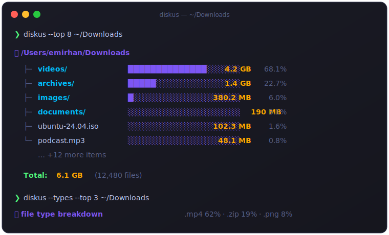
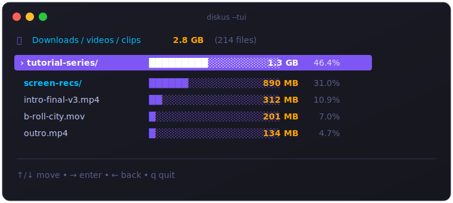

<div align="center">

# 📁 diskus

### See what's eating your disk — fast, colorful, interactive.

**English** · [Türkçe](#-türkçe)

<br/>

[](https://github.com/Emiran404/diskus/releases/latest)
[](https://go.dev)
[](LICENSE)
[](#-installation)

<br/>



</div>

<br/>

## ✨ Why diskus?

`du` is cryptic. Finder lies. **diskus** scans any folder concurrently and shows you — in one glance — where your gigabytes went. Then lets you *walk into* the result like a file manager.

<table>
<tr>
<td width="50%" valign="top">

### 🎨 Beautiful by default
Tree view with size bars, percentages and colors. Pipe-friendly: colors auto-off when redirected, honors `NO_COLOR`.

### ⚡ Fast by design
Top-level directories are scanned **in parallel** with goroutines. A 25 GB projects folder? Seconds.

### 🕹️ Interactive TUI
`diskus --tui` opens a navigable browser — arrow keys to dive into folders, built with [Bubble Tea](https://github.com/charmbracelet/bubbletea).

</td>
<td width="50%" valign="top">

### 📊 File-type X-ray
`--types` answers "*what kind* of stuff is big" — `.mp4 62%`, `.zip 19%`…

### 🌍 Speaks 10 languages
TR · EN · DE · FR · ES · IT · PT · RU · ZH · JA — auto-detects your system language.

### 📦 Single binary
No runtime, no dependencies. Download & run on **macOS, Linux, Windows**.

</td>
</tr>
</table>

<div align="center">

</div>

## 🚀 Quick start

```bash
diskus                          # current folder, sorted by size
diskus --tui ~/Downloads        # interactive browser
diskus --types --top 10         # which file types eat the disk
diskus --top 5 --depth 2        # tree: 2 levels, 5 biggest per level
diskus --min 100mb --sort count # hide small stuff, sort by file count
diskus --disk                   # real allocated disk usage (like du)
diskus --json . > report.json   # machine-readable
```

## 📦 Installation

<details open>
<summary><b>🍎 macOS</b></summary>

```bash
# Apple Silicon (M1/M2/M3): arm64  ·  Intel: amd64
curl -L -o diskus https://github.com/Emiran404/diskus/releases/latest/download/diskus-darwin-arm64
chmod +x diskus
xattr -d com.apple.quarantine diskus 2>/dev/null   # clear Gatekeeper flag
sudo mv diskus /usr/local/bin/
diskus --version
```

> Unsigned binary — if macOS warns "developer cannot be verified", the `xattr` line above fixes it (or right-click → Open in Finder).

</details>

<details>
<summary><b>🐧 Linux</b></summary>

```bash
# amd64 for most machines  ·  ARM: diskus-linux-arm64
curl -L -o diskus https://github.com/Emiran404/diskus/releases/latest/download/diskus-linux-amd64
chmod +x diskus
sudo mv diskus /usr/local/bin/
diskus --version
```

</details>

<details>
<summary><b>🪟 Windows (PowerShell)</b></summary>

```powershell
Invoke-WebRequest -Uri "https://github.com/Emiran404/diskus/releases/latest/download/diskus-windows-amd64.exe" -OutFile "diskus.exe"
mkdir "$env:USERPROFILE\bin" -Force
move diskus.exe "$env:USERPROFILE\bin\"
setx PATH "$env:PATH;$env:USERPROFILE\bin"
# open a new terminal, then:
diskus --version
```

</details>

<details>
<summary><b>🌍 Any platform — with Go</b></summary>

```bash
go install github.com/Emiran404/diskus@latest
```

Or build from source:

```bash
git clone https://github.com/Emiran404/diskus.git
cd diskus
make install      # or: go install .
```

> If `diskus: command not found`, add `~/go/bin` (Windows: `%USERPROFILE%\go\bin`) to your `PATH`.

</details>

> **Which arch?** macOS Apple Silicon = `arm64` · Linux: `uname -m` (`x86_64` → amd64, `aarch64` → arm64) · Windows is usually `amd64`.

## ⚙️ Options

| Flag | Description | Default |
|:-----|:------------|:-------:|
| `--top N` | Largest N items per level (0 = all) | `0` |
| `--depth N` | Nested levels to show (0 = unlimited) | `1` |
| `--tui` | Interactive browser | — |
| `--types` | Size breakdown by file extension | — |
| `--sort` | `size` · `name` · `count` | `size` |
| `--reverse` | Reverse sort order | — |
| `--min` | Hide items below size (e.g. `10mb`) | — |
| `--unit` | `auto` · `b` · `kb` · `mb` · `gb` · `tb` | `auto` |
| `--all` | Include hidden files | — |
| `--exclude a,b` | Names to skip | `node_modules,.git,vendor` |
| `--follow` | Follow symlinks (loop-safe) | — |
| `--disk` | Allocated disk space, like `du` | — |
| `--json` | JSON output | — |
| `--no-color` | Disable colors (also `NO_COLOR` env) | — |
| `--verbose` | List inaccessible paths | — |
| `--lang` | UI language for this run | `auto` |
| `--set-lang` | Save language permanently | — |
| `--version` | Show version | — |

### 🌍 Languages

Priority: `--lang` flag → `DISKUS_LANG` env → saved setting → system language.

```bash
diskus --lang de .        # German, this run only
diskus --set-lang en      # English, permanently
diskus --set-lang auto    # back to system language
```

## 🖥️ TUI keys

| Key | Action |
|:---:|:-------|
| `↑` `↓` / `k` `j` | move |
| `→` / `l` / `Enter` | enter folder |
| `←` / `h` / `Backspace` | go back |
| `g` / `G` | jump to top / bottom |
| `q` / `Esc` | quit |

## 🤝 Contributing

Issues and PRs are welcome! To add a new language, add a column to [`catalog.go`](catalog.go) and register the code in [`i18n.go`](i18n.go) — that's it.

## 📄 License

[MIT](LICENSE) © Emirhan Gök

<br/>

---

<br/>

<div align="center">

# 🇹🇷 Türkçe

### Diskini ne yiyor? — hızlı, renkli, interaktif.

</div>

## ✨ Neden diskus?

`du` kriptik, Finder yalan söylüyor. **diskus** herhangi bir klasörü paralel tarar ve gigabaytlarının nereye gittiğini tek bakışta gösterir. Sonra sonucun *içinde gezinmene* izin verir.

- 🎨 **Varsayılan olarak güzel** — çubuklu, yüzdeli, renkli ağaç görünümü
- ⚡ **Tasarımı gereği hızlı** — üst seviye klasörler goroutine'lerle paralel taranır
- 🕹️ **İnteraktif gezgin** (`--tui`) — ok tuşlarıyla klasörlere gir/çık
- 📊 **Dosya türü röntgeni** (`--types`) — "büyük olan *ne tür* şeyler?"
- 💽 **Gerçek disk kullanımı** (`--disk`) — `du` gibi ayrılan blok
- 🔗 **Döngü korumalı symlink** (`--follow`)
- 🌍 **10 dil** — sistem dilini otomatik algılar
- 📦 **Tek binary** — macOS · Linux · Windows

## 🚀 Hızlı başlangıç

```bash
diskus                          # bulunduğun klasör
diskus --tui ~/Downloads        # interaktif gezgin
diskus --types --top 10         # hangi dosya türü ne kadar yer kaplıyor
diskus --top 5 --depth 2        # ağaç: 2 seviye, seviye başına en büyük 5
diskus --min 100mb --sort count # küçükleri gizle, dosya sayısına göre sırala
diskus --json . > rapor.json    # makine-okur çıktı
```

## 📦 Kurulum

<details open>
<summary><b>🍎 macOS</b></summary>

```bash
# Apple Silicon (M1/M2/M3): arm64  ·  Intel: amd64
curl -L -o diskus https://github.com/Emiran404/diskus/releases/latest/download/diskus-darwin-arm64
chmod +x diskus
xattr -d com.apple.quarantine diskus 2>/dev/null   # Gatekeeper uyarısını kaldır
sudo mv diskus /usr/local/bin/
diskus --version
```

> Binary imzasız — macOS "geliştirici doğrulanamadı" derse yukarıdaki `xattr` satırı çözer (ya da Finder'da sağ tık → Aç).

</details>

<details>
<summary><b>🐧 Linux</b></summary>

```bash
# Çoğu makine için amd64  ·  ARM: diskus-linux-arm64
curl -L -o diskus https://github.com/Emiran404/diskus/releases/latest/download/diskus-linux-amd64
chmod +x diskus
sudo mv diskus /usr/local/bin/
diskus --version
```

</details>

<details>
<summary><b>🪟 Windows (PowerShell)</b></summary>

```powershell
Invoke-WebRequest -Uri "https://github.com/Emiran404/diskus/releases/latest/download/diskus-windows-amd64.exe" -OutFile "diskus.exe"
mkdir "$env:USERPROFILE\bin" -Force
move diskus.exe "$env:USERPROFILE\bin\"
setx PATH "$env:PATH;$env:USERPROFILE\bin"
# yeni bir terminal aç, sonra:
diskus --version
```

</details>

<details>
<summary><b>🌍 Her platform — Go ile</b></summary>

```bash
go install github.com/Emiran404/diskus@latest
```

Ya da kaynaktan:

```bash
git clone https://github.com/Emiran404/diskus.git
cd diskus
make install
```

> `diskus: command not found` alırsan `~/go/bin` (Windows: `%USERPROFILE%\go\bin`) klasörünü PATH'e ekle.

</details>

> **Hangi mimari?** macOS Apple Silicon = `arm64` · Linux: `uname -m` (`x86_64` → amd64, `aarch64` → arm64) · Windows genelde `amd64`.

## ⚙️ Seçenekler

| Bayrak | Açıklama | Varsayılan |
|:-------|:---------|:----------:|
| `--top N` | Her seviyede en büyük N öğe (0 = hepsi) | `0` |
| `--depth N` | İç içe seviye sayısı (0 = sınırsız) | `1` |
| `--tui` | İnteraktif gezgin | — |
| `--types` | Uzantıya göre boyut dökümü | — |
| `--sort` | `size` · `name` · `count` | `size` |
| `--reverse` | Sıralamayı ters çevir | — |
| `--min` | Bu boyutun altını gizle (ör. `10mb`) | — |
| `--unit` | `auto` · `b` · `kb` · `mb` · `gb` · `tb` | `auto` |
| `--all` | Gizli dosyaları dahil et | — |
| `--exclude a,b` | Atlanacak adlar | `node_modules,.git,vendor` |
| `--follow` | Symlink'leri takip et (döngü korumalı) | — |
| `--disk` | `du` gibi ayrılan disk alanı | — |
| `--json` | JSON çıktı | — |
| `--no-color` | Renkleri kapat (`NO_COLOR` da geçerli) | — |
| `--verbose` | Erişilemeyen yolları listele | — |
| `--lang` | Bu çalıştırma için arayüz dili | `auto` |
| `--set-lang` | Dili kalıcı kaydet | — |
| `--version` | Sürümü göster | — |

### 🌍 Diller

Öncelik: `--lang` bayrağı → `DISKUS_LANG` ortam değişkeni → kayıtlı ayar → sistem dili.

```bash
diskus --lang de .        # sadece bu sefer Almanca
diskus --set-lang en      # kalıcı İngilizce
diskus --set-lang auto    # sistem diline dön
```

## 🤝 Katkı

Issue ve PR'lara açığız! Yeni dil eklemek için [`catalog.go`](catalog.go)'ya bir sütun ekleyip kodu [`i18n.go`](i18n.go)'da kaydetmen yeterli.

## 📄 Lisans

[MIT](LICENSE) © Emirhan Gök

<br/>

<div align="center">

**⭐ Faydalı bulduysan bir yıldız bırak — If you find diskus useful, give it a star!**

</div>
